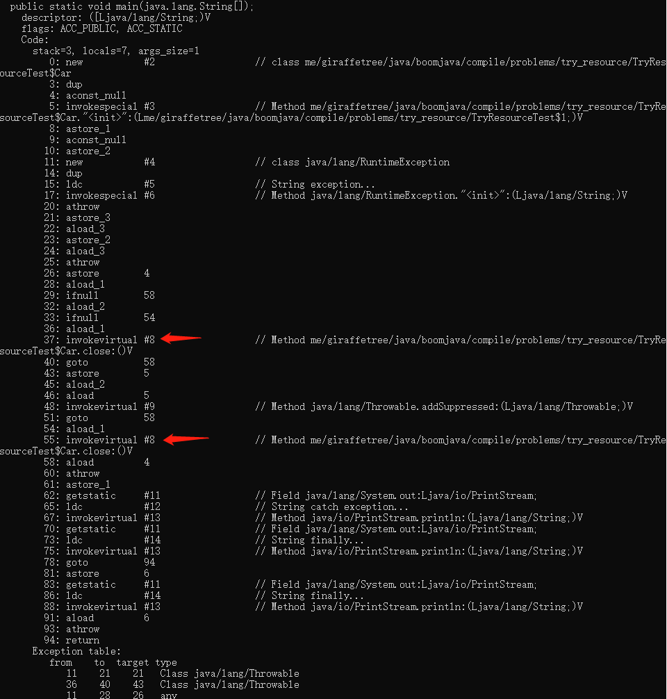

# README

## try resource 中的 close 方法, 与 finally 块哪个先执行 


```
public static void main(String[] args) {
    try (Car car = new Car()){
        throw new RuntimeException("exception...");
    } catch (Exception e) {
        System.out.println("catch exception...");
    }finally {
        System.out.println("finally...");
    }
}
private static class Car implements AutoCloseable {
    @Override
    public void close() throws Exception {
        System.out.println("close...");
    }
}
```

我们需要先编译看下 字节码

- `javac -encoding utf8 TryResourceTest.java`

查看下字节码

- `javap -v TryResourceTest`



