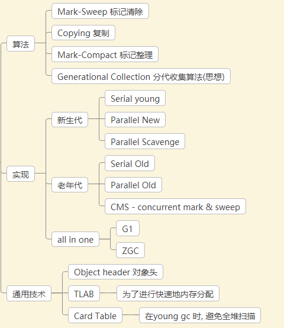

# 卡表中的 falseSharing

## 背景

第一个问题, JVM 为什么要进行分代回收? 

原因很简单, 大部分对象只存活一小段时间. 基于这一个假设, jvm 引入了多种不同的垃圾回收算法针对不同代的垃圾回收



比如在新生代我们可以频繁的使用 复制算法, 它的时间复杂度等同于存活对象的个数

但是在使用分代算法之后, 我们很快地遇到一个问题:

有一些在老年代中的对象引用了新生代, 这样的话垃圾回收器就不高兴了, 难道我还要再重新扫描一遍老年代? 这不就和 full gc 一样了么?

这就是一个著名("臭名昭著")的分代间指针问题.

为了减少对堆的扫描, 提高效率, 聪明的程序猿们?引入了 remembered set (记忆集)

> Remembered Set是在实现部分垃圾收集（partial GC）时用于记录从非收集部分指向收集部分的指针的集合的抽象数据结构。
> 而card table 是 remembered set的一种实现方式。[5]

根据openjdk 官网描述 [8]

> card table:
>
> A kind of remembered set that records where oops have changed in a generation.

> remembered set:
>
> A data structure that records pointers between generations.

于是就有了, 为了避免 minor GC (新生代GC) 对全堆的扫描, hotspot 引入了 cardTable 技术 [1]

### 如何实现 卡表 [1]

> 该技术将整个堆划分为一个个大小为 512 字节的卡，并且维护一个卡表，用来存储每张卡的一个标识位。[见注]
> 这个标识位代表对应的卡是否可能存有指向新生代对象的引用。如果可能存在，那么我们就认为这张卡是脏的。

注: card table 中 1个字节对应的是 512字节 [7]

> 在进行 Minor GC 的时候，我们便可以不用扫描整个老年代，而是在卡表中寻找脏卡，
> 并将脏卡中的对象加入到 Minor GC 的 GC Roots 里。当完成所有脏卡的扫描之后，Java 虚拟机便会将所有脏卡的标识位清零。

### 实现

首先，如果想要保证每个可能有指向新生代对象引用的卡都被标记为脏卡，
那么 Java 虚拟机需要截获每个引用型实例变量的写操作，并作出对应的写标识位操作。

这个操作在解释执行器中比较容易实现。但是在即时编译器生成的机器码中，
则需要插入额外的逻辑。这也就是所谓的写屏障（write barrier）。[1]

伪代码如下 [10]

```
CARD_TABLE [this address >> 9] = DIRTY;
```

虽然CardTable提高了Minor GC 的效率, 但在高并发环境下，写屏障又带来了虚共享（false sharing）问题 [1]

##  虚共享

缓存行长度一般为 64 字节, 按照 其中 1 字节 可以表示 512 字节, 则 64字节长度的卡表可以表示 64 * 512 字节, 
即对应的实际内存大小为 32KB


### 验证

为了验证 false sharing 的存在, 
我们需要构造一个 老年代 -> eden 代的引用, 我这里使用大对象直接进入老年代的机制来构造这个对象[4]

其中两个对象

### 另外介绍下 UseCondCardMark

`-XX:+UseCondCardMark` 通过事先判断了card 是否 dirty , 减少 card table 的写入, 从而提高性能, 减少false sharing [1]

```
if (CARD_TABLE [this address >> 9] != DIRTY) 
  CARD_TABLE [this address >> 9] = DIRTY;
```

### 测试

测试环境: 

[CardTableFalseSharingTest](./CardTableFalseSharingTest.java)

```java
public class CardTableFalseSharingTest {
    private final static ExecutorService EXECUTOR_SERVICE = ExecutorUtils.getExecutorService(2, 2);
//    private final static ExecutorService EXECUTOR_SERVICE = Executors.newFixedThreadPool(2);


    public static void main(String[] args) throws InterruptedException {

        int loop = 10_000_000;
        int retry = 10;
        test(loop, retry);

        EXECUTOR_SERVICE.shutdown();
        EXECUTOR_SERVICE.awaitTermination(1000L, TimeUnit.MILLISECONDS);
    }

    private static void test(int loop, int retry) {
        // 在同一个线程中分配两个对象, 由于 TLAB 的存在, 理论上这两个对象相距很近
        Obj64 x1 = new Obj64();
        Obj64 x2 = new Obj64();
        // 大对象直接进入老年代, 为了得到一个 老年代 -> eden 代的引用
        HugeObj hugeObj10M = new HugeObj(10 * 1024 * 1024, x1, x2);
        testX1AndX2(loop, retry, x1, x2, hugeObj10M);
    }

    private static void testX1AndX2(final int loop, final int retry, final Obj64 x1, final Obj64 x2, final HugeObj hugeObj) {
        long all = 0L;
        int r = retry;
        long[] record = new long[retry];
        while (r-- > 0) {
            final CountDownLatch endLatch = new CountDownLatch(2);
            long l1 = System.currentTimeMillis();
            EXECUTOR_SERVICE.execute(() -> {
                int count = loop;
                while (count-- > 0) {
                    if ((count & 1) == 0) {
                        hugeObj.x1 = x1;
                    } else {
                        hugeObj.x1 = x2;
                    }
                }
                endLatch.countDown();
            });
            EXECUTOR_SERVICE.execute(() -> {
                int count = loop;
                while (count-- > 0) {
                    if ((count & 1) == 0) {
                        hugeObj.x2 = x2;
                    } else {
                        hugeObj.x2 = x1;
                    }
                }
                endLatch.countDown();
            });

            try {
                endLatch.await();
                long l2 = System.currentTimeMillis();
                all += (l2 - l1);
                record[retry - 1 - r] = l2 - l1;
            } catch (InterruptedException e) {
                e.printStackTrace();
            }
        }
        System.out.println(String.format("average:%dms %s", all / retry, Arrays.toString(record)));

    }

    private static class Obj64 {
        long l1;
        long l2, l3, l4, l5;
    }

    private static class HugeObj {
        private byte[] hugeArray;
        private Obj64 x1;
        private Obj64 x2;

        public HugeObj(int byteLen, Obj64 x1, Obj64 x2) {
            this.hugeArray = new byte[byteLen];
            this.x1 = x1;
            this.x2 = x2;
        }
    }
}
```

### 结果

可以看到在 jdk8 上差距比较明显, 使用 `-XX:+UseCondCardMark` 优化确实有效果

而在 jdk11 上, 差距很小(todo why)

```
* jdk1.8.0_161 上运行
* 不使用
* average:158ms [257, 111, 116, 210, 164, 131, 187, 120, 146, 147]
* average:167ms [228, 188, 148, 133, 169, 180, 159, 130, 183, 154]
* 使用  -XX:+UseCondCardMark
* average:26ms [116, 17, 12, 13, 12, 13, 27, 31, 12, 14]
* average:40ms [117, 23, 33, 33, 34, 32, 34, 33, 32, 33]

* jdk11.0.7 上运行
* 不使用
* average:32ms [103, 18, 32, 17, 12, 35, 34, 32, 31, 15]
* 使用 -XX:+UseCondCardMark
* average:28ms [73, 17, 13, 33, 33, 22, 13, 13, 33, 32]
* average:30ms [63, 35, 31, 13, 19, 36, 32, 13, 32, 33]
```

## 参考

1. 极客时间 垃圾回收
    - https://time.geekbang.org/column/article/13137
2. Why use Conditional Card Marking, in a Concurrent System 
    - http://robsjava.blogspot.com/2013/03/why-to-use-conditional-card-marking.html
3. `-XX：+ UseCondCardMark` 可以在高度并行的应用程序中帮助您
    - https://stackoverflow.com/questions/28568171/examples-for-code-that-is-surprisingly-affected-by-jvm-jvm-options
4. PretenureSizeThreshold 的默认值和作用
    - https://juejin.im/post/5d1b048ff265da1bb67a326e
5. R大对 card table 与 RSET 的关系描述
    - https://hllvm-group.iteye.com/group/topic/21468#post-272070
6. rset card table 等概念
    - https://www.cnblogs.com/stevenczp/p/6595995.html
7. hotspot card table 中 一个字节对应512个字节
    - https://stackoverflow.com/a/19173218
8. card table 官方定义
    - https://openjdk.java.net/groups/hotspot/docs/HotSpotGlossary.html#cardTable
9. 垃圾回收算法手册 自动内存管理的艺术 Richard Jones/Antony Hosking/Eilot Moss
    - P105  9.8 分代间指针
10. src/hotspot/share/gc/shared/cardTable.hpp 166
    - https://github.com/infobip/infobip-open-jdk-8/blob/master/hotspot/src/share/vm/memory/cardTableModRefBS.hpp#L164


