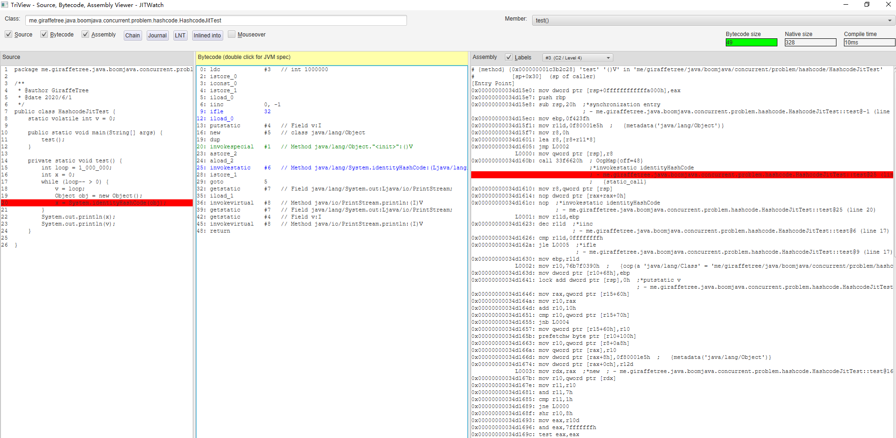

# java hashcode 的实现

## 引子

今天偶然去查了下 Object 实例的 `hashcode` 方法 与 `System.identityHashCode(obj)` 
有什么不同 [1]

java doc 中说过, 同一个对象的 hashcode 方法调用多次时, 都应当返回同一个值 

[1]答案中说,  `System.identityHashCode` 方法, 会在 object header 中存保存一个 hashcode 值

- 如果 header 中存在 hashcode 则直接返回
- 否则, 随机生成一个int值, 然后通过 cas 替换 header

这么一想, 如果底层通过cas实现的话, 那还可能产生 false sharing 问题

### 产生的问题

1. obj header 中真的保存了 hashcode 么?
2. 如果进入偏向锁之后, 调用 `System.identityHashcode` 方法会导致偏向锁撤销么?
3. 调用 `System.identityHashCode` 方法, 是否会产生 false sharing 问题

## 思考与实验

### header 中的 hashcode

源文件 [HashcodeTest.java](./HashcodeTest.java)

在 jdk8 环境中, 输出如下:

```
before:    00 00 00 00 00 00 00 01
hashcode: 517938326
hashcode: 1E DF 1C 96
after:     00 00 00 1E DF 1C 96 01
```

可以看到在调用 `Object.hashcode()` 方法 或者 `System.identityHashcode` 方法后, 对象头中的 mark word 都发生了改变.
我自己的理解是, `Object.hashcode()` 方法(不考虑重写的情况下)底层可能调用了 `System.identityHashcode` 的相同实现

根据 `markOop.hpp` [2] 中描述的, 有 31 bit 用于存储 hashcode

```
64 bits:
--------
unused:25 hash:31 -->| unused:1   age:4    biased_lock:1 lock:2 (normal object)
```

### 偏向锁 与 System.identityHashcode

源码参见: [HashcodeBiasedLockTest](./HashcodeBiasedLockTest.java)

使用 `-XX:+UnlockDiagnosticVMOptions -XX:+PrintBiasedLockingStatistics -XX:BiasedLockingStartupDelay=0` 启动

运行 `test` 方法 的结果如下, 从结果来看, 在同步块之外调用 hashcode 方法(`Object.hashcode()`或`System.identityHashcode` 都行), 
会使该对象变为偏向锁不可用的状态, mark word 最后 3个bit 为 `001` , hashcode 仍然存储在 mark word 中

```
偏向锁可用:     00 00 00 00 00 00 00 05
偏向锁已经加锁:   00 00 00 00 02 85 38 05
同步块之外:     00 00 00 00 02 85 38 05
hashcode: 06 99 6D B8
哈希code执行后: 00 00 00 06 99 6D B8 01
```

运行 `testHashInSync` 方法, 从结果来看, 在同步块中调用 hashcode 方法, 会导致锁升级至 重量级锁, 
**mark word中 , 最后 2个bit 为 `10` , hashcode 并不存储在 mark word 中, 但多次执行 hashcode 方法能得到同一个值

```
偏向锁可用:     00 00 00 00 00 00 00 05
已进入同步块.....
//  JavaThread*:54 epoch:2 unused:1   age:4    biased_lock:1 lock:2 (biased object)
// 32位0 + 00000010 + 01100110 + 00111000 + 00000101
偏向锁已经加锁:   00 00 00 00 02 66 38 05
hashcode: 06 99 6D B8
哈希code执行后: 00 00 00 00 1B CE ED 3A
已退出同步块......
同步块之外:     00 00 00 00 1B CE ED 3A
再次hashcode:06 99 6D B8
标记字:       00 00 00 00 1B CE ED 3A
before lock: 00 00 00 00 1B CE ED 3A

thread-0 get lock
标记字: thread-0   00 00 00 00 1B CE ED 3A
再次hashcode: thread-0  06 99 6D B8
标记字: thread-0   00 00 00 00 1B CE ED 3A
```

我把 `Object.hashcode()`和`System.identityHashcode` 都测试了下, 结果一致

所以结论是, 调用 `Object.hashcode()`或`System.identityHashcode` 方法会导致偏向锁撤销.

另外 [1] 中答案说, hashcode 随机生成, 但是从 测试2 中来看, hashcode 方法像是被存储在某个地方, 或者有一个固定的计算方式(地址?)

### 调用 `System.identityHashCode` 方法, 是否会产生 false sharing 

https://github.com/unofficial-openjdk/openjdk/blob/ec8284f6b5c2cfc626f1c07741675c33ec3c9601/src/hotspot/share/runtime/synchronizer.cpp

FastHashCode

    
### System.identityHashcode 与JIT

尝试打印了 [HashcodeJitTest](./HashcodeJitTest.java) 中 jit 编译后的汇编代码

突然想起来 R大的一句话 [3]

> 跨越native边界会对优化有阻碍作用，它就像个黑箱一样让虚拟机难以分析也将其内联，于是运行时间长了之后反而是托管版本的代码更快些。

汇编后的代码中直接使用 call [4] 调用了 native 函数, jit 编译器无法将其内联优化, 效率很低. 就像 R大说的一样, 这是一个黑盒, 
我都不知道它在干什么, 那怎么进行优化呢. 所以当我们将一个对象作为一个 hash 表的key 时, 请一定记得实现 hashcode 方法.



## 参考

1. https://stackoverflow.com/questions/4930781/how-do-hashcode-and-identityhashcode-work-at-the-back-end
2. http://hg.openjdk.java.net/jdk8/jdk8/hotspot/file/87ee5ee27509/src/share/vm/oops/markOop.hpp
3. https://www.iteye.com/blog/rednaxelafx-548536
4. 汇编中的 call
    - http://www.ruanyifeng.com/blog/2018/01/assembly-language-primer.html

