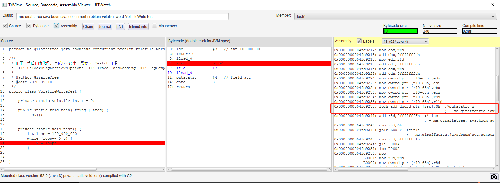

# 概述

java 底层实现 volatile 就是在指令前加 LOCK , 至于 CPU 怎么去完成 LOCK 的语义可能会有不同, 而CPU在底层实现上不同, 于是就产生了两种实现,  锁总线和锁缓存行

在MESIF 出现之前, 读写操作都需要向 bus 
 MESIF 主要是降低了读操作的时延, 

## Volatile 

使用 JITwatch 分析 , lock 前缀 原始日志文件见: [VolatileWriteTest-hotspot.log](./VolatileWriteTest-hotspot.log)

## CAS 

lock cmpxchg 原始日志文件见: [AtomicIntegerTest-hotspot.log](./AtomicIntegerTest-hotspot.log)

## cpu lock 指令

Intel 64 位和 IA-32 架构开发人员手册：卷 2A  第3章中写道 

> In a multiprocessor environment, the LOCK# signal ensures that the processor has exclusive use of any shared memory while the signal is asserted.
> 
> 在多处理器环境中，LOCK＃信号可确保在断言该信号时，处理器拥有对任何共享内存的独占使用(机翻=.=)

Intel 64 位和 IA-32 架构开发人员手册：卷 3A 8.1.4 Effects of a LOCK Operation on Internal Processor Caches 中写道 

> For the Intel486 and Pentium processors, the LOCK# signal is always asserted on the bus during a LOCK operation,
  even if the area of memory being locked is cached in the processor.
  For the P6 and more recent processor families, if the area of memory being locked during a LOCK operation is
  cached in the processor that is performing the LOCK operation as write-back memory and is completely contained
  in a cache line, the processor may not assert the LOCK# signal on the bus. Instead, it will modify the memory location internally and allow it’s cache coherency mechanism to ensure that the operation is carried out atomically. This
  operation is called “cache locking.” The cache coherency mechanism automatically prevents two or more processors that have cached the same area of memory from simultaneously modifying data in that area.
>
> 对于Intel486和Pentium处理器，始终在LOCK操作期间在总线上声明LOCK＃信号，即使被锁定的内存区域被缓存在处理器中。对于P6和更新的处理器系列，如果在LOCK操作期间锁定的内存区域为缓存在正在执行LOCK操作的处理器中，作为回写内存并完全包含在其中在高速缓存行中，处理器可能不会在总线上声明LOCK＃信号。 取而代之的是，它将在内部修改内存位置，并允许其缓存一致性机制来确保该操作是原子执行的。 这个该操作称为“缓存锁定”。 高速缓存一致性机制会自动阻止已缓存相同内存区域的两个或更多处理器同时修改该区域中的数据(机翻)

个人理解, 现在有两个处理器P1,P2, 它们都想修改同一个内存区域的数据, 如果没有 MESIF (缓存一致性机制) 它们会通过 总线LOCK 来确保不会造成写冲突;
如果有了 MESIF, 并且要修改的这块内存区域完全包含在高速缓存行中, 处理器可以通过缓存一致性的机制, 在处理器内部修改内存, 并确保该操作时原子执行的

## 参考

1. lock 与 MESI
    - https://stackoverflow.com/questions/29880015/lock-prefix-vs-mesi-protocol
2. MESIF
    - https://zhuanlan.zhihu.com/p/24146167
3. intel lock 指令介绍
    - 英特尔® 64 位和 IA-32 架构开发人员手册：卷 2A
        - https://www.intel.cn/content/www/cn/zh/architecture-and-technology/64-ia-32-architectures-software-developer-vol-2a-manual.html
    - 英特尔® 64 位和 IA-32 架构开发人员手册：卷 3A
        - https://www.intel.cn/content/www/cn/zh/architecture-and-technology/64-ia-32-architectures-software-developer-vol-3a-part-1-manual.html
4. lock 和 MESIF 的区别
    - https://stackoverflow.com/questions/25476662/when-can-the-cpu-ignore-the-lock-prefix-and-use-cache-coherency