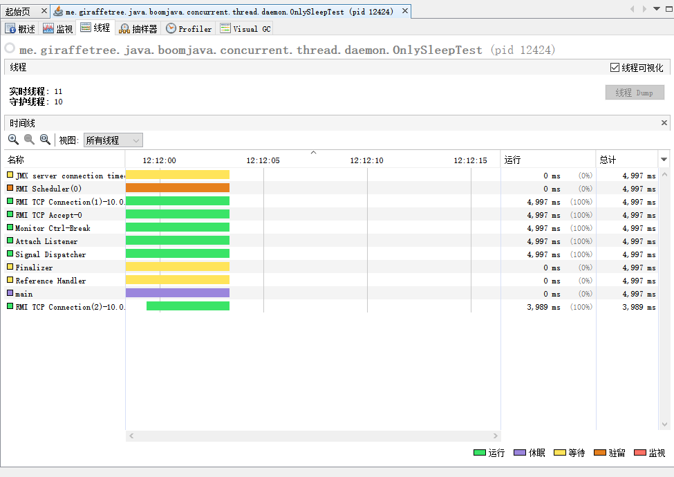

# JAVA 中的守护线程

## 概述

1.  java 中的守护线程有哪些?
2. 

## 有哪些守护线程

### jvisualvm

先看一张图, 只运行了一个 main 方法, 看下有哪些奇怪的线程



- JMX server connection timeout 24
- RMI Scheduler(0)
- RMI TCP Connection 
- RMI TCP Accept-0
- Monitor Ctrl-Break
- Attach Listener
- Signal Dispatcher
- Finalizer
- Reference Handler
- main

### jstak 


相比之下 jstack 的线程信息更全, 包含了 JIT 编译器的线程, GC 线程

> $ jstack 12780
> 2020-05-01 12:15:59
> Full thread dump Java HotSpot(TM) 64-Bit Server VM (25.161-b12 mixed mode):
> "**Service Thread**" #19 daemon prio=9 os_prio=0 tid=0x0000000023778800 nid=0x4ab8 runnable [0x0000000000000000]
> java.lang.Thread.State: RUNNABLE
> "**C1 CompilerThread11**" #18 daemon prio=9 os_prio=2 tid=0x0000000020f70000 nid=0x4fb4 waiting on condition [0x0000000000000000]
> java.lang.Thread.State: RUNNABLE
> "**C1 CompilerThread10**" #17 daemon prio=9 os_prio=2 tid=0x0000000020f72000 nid=0xbf0 waiting on condition [0x0000000000000000]
> java.lang.Thread.State: RUNNABLE
> "**C1 CompilerThread9**" #16 daemon prio=9 os_prio=2 tid=0x0000000020f76800 nid=0x55a8 waiting on condition [0x0000000000000000]
> java.lang.Thread.State: RUNNABLE
> "**C1 CompilerThread8**" #15 daemon prio=9 os_prio=2 tid=0x0000000020f76000 nid=0x5750 waiting on condition [0x0000000000000000]
> java.lang.Thread.State: RUNNABLE
> "**C2 CompilerThread7**" #14 daemon prio=9 os_prio=2 tid=0x0000000020f71800 nid=0x3014 waiting on condition [0x0000000000000000]
> java.lang.Thread.State: RUNNABLE
> "**C2 CompilerThread6**" #13 daemon prio=9 os_prio=2 tid=0x0000000020f4d000 nid=0x4140 waiting on condition [0x0000000000000000]
> java.lang.Thread.State: RUNNABLE
> "**C2 CompilerThread5**" #12 daemon prio=9 os_prio=2 tid=0x0000000020f39800 nid=0x4fc waiting on condition [0x0000000000000000]
> java.lang.Thread.State: RUNNABLE
> "**C2 CompilerThread4**" #11 daemon prio=9 os_prio=2 tid=0x0000000020f18800 nid=0x4338 waiting on condition [0x0000000000000000]
> java.lang.Thread.State: RUNNABLE
> "**C2 CompilerThread3**" #10 daemon prio=9 os_prio=2 tid=0x0000000020efb000 nid=0x11e8 waiting on condition [0x0000000000000000]
> java.lang.Thread.State: RUNNABLE
> "**C2 CompilerThread2**" #9 daemon prio=9 os_prio=2 tid=0x0000000020efa000 nid=0x2348 waiting on condition [0x0000000000000000]
> java.lang.Thread.State: RUNNABLE
> "**C2 CompilerThread1**" #8 daemon prio=9 os_prio=2 tid=0x0000000020edf000 nid=0x3a1c waiting on condition [0x0000000000000000]
> java.lang.Thread.State: RUNNABLE
> **"C2 CompilerThread0**" #7 daemon prio=9 os_prio=2 tid=0x0000000020ef9800 nid=0x2dcc waiting on condition [0x0000000000000000]
> java.lang.Thread.State: RUNNABLE
> "**Monitor Ctrl-Break**" #6 daemon prio=5 os_prio=0 tid=0x0000000020e2f800 nid=0x474c runnable [0x0000000022a5e000]
> java.lang.Thread.State: RUNNABLE
>   "**Attach Listener**" #5 daemon prio=5 os_prio=2 tid=0x0000000020d26800 nid=0x8a0 waiting on condition [0x0000000000000000]
>   java.lang.Thread.State: RUNNABLE
> "**Signal Dispatcher**" #4 daemon prio=9 os_prio=2 tid=0x0000000020ccc800 nid=0xe04 runnable [0x0000000000000000]
> java.lang.Thread.State: RUNNABLE
> "**Finalizer**" #3 daemon prio=8 os_prio=1 tid=0x0000000020ca6800 nid=0x1e38 in Object.wait() [0x00000000225ff000]
> java.lang.Thread.State: WAITING (on object monitor)
>  "**Reference Handler**" #2 daemon prio=10 os_prio=2 tid=0x000000001f212800 nid=0xda8 in Object.wait() [0x00000000224ff000]
>   java.lang.Thread.State: WAITING (on object monitor)
>   "**main**" #1 prio=5 os_prio=0 tid=0x0000000005194800 nid=0x3f04 waiting on condition [0x0000000004f9f000]
>   java.lang.Thread.State: TIMED_WAITING (sleeping)
> "**VM Thread**" os_prio=2 tid=0x0000000020c85000 nid=0x537c runnable
> **"GC task thread#0 (ParallelGC)"** os_prio=0 tid=0x00000000051aa000 nid=0x28d8 runnable
> **"GC task thread#1 (ParallelGC)**" os_prio=0 tid=0x00000000051ac000 nid=0xe4c runnable
> **"GC task thread#2 (ParallelGC)**" os_prio=0 tid=0x00000000051ad800 nid=0x4e38 runnable
> **"GC task thread#3 (ParallelGC)"** os_prio=0 tid=0x00000000051af000 nid=0x4c10 runnable
> **"GC task thread#4 (ParallelGC)"** os_prio=0 tid=0x00000000051b1000 nid=0x4058 runnable
> **"GC task thread#5 (ParallelGC)"** os_prio=0 tid=0x00000000051b3800 nid=0x3f20 runnable
> **"GC task thread#6 (ParallelGC)"** os_prio=0 tid=0x00000000051b6800 nid=0x3858 runnable
> **"GC task thread#7 (ParallelGC)"** os_prio=0 tid=0x00000000051b7800 nid=0x2840 runnable
> **"GC task thread#8 (ParallelGC)"** os_prio=0 tid=0x00000000051b9000 nid=0x5080 runnable
> **"GC task thread#9 (ParallelGC)"** os_prio=0 tid=0x00000000051ba000 nid=0x46b0 runnable
> **"GC task thread#10 (ParallelGC)"** os_prio=0 tid=0x00000000051bb000 nid=0x2a64 runnable
> **"GC task thread#11 (ParallelGC)"** os_prio=0 tid=0x00000000051be800 nid=0x4168 runnable
> **"GC task thread#12 (ParallelGC)"** os_prio=0 tid=0x00000000051bf800 nid=0x4760 runnable
> "**VM Periodic Task Thread**" os_prio=2 tid=0x0000000020fde000 nid=0x40e4 waiting on condition
> JNI global references: 30


### type

```java
 enum ThreadType {
    vm_thread,
    cgc_thread,        // Concurrent GC thread
    pgc_thread,        // Parallel GC thread
    java_thread,       // Java, CodeCacheSweeper, JVMTIAgent and Service threads.
    compiler_thread,
    watcher_thread,
    os_thread
  };
```

## 参考


 https://www.javatang.com/archives/2017/10/19/51301886.html 

 https://stackoverflow.com/questions/15251250/what-do-the-different-hotspot-jvm-thread-types-do 