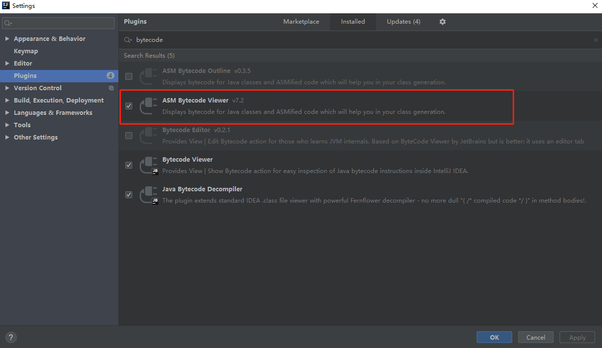
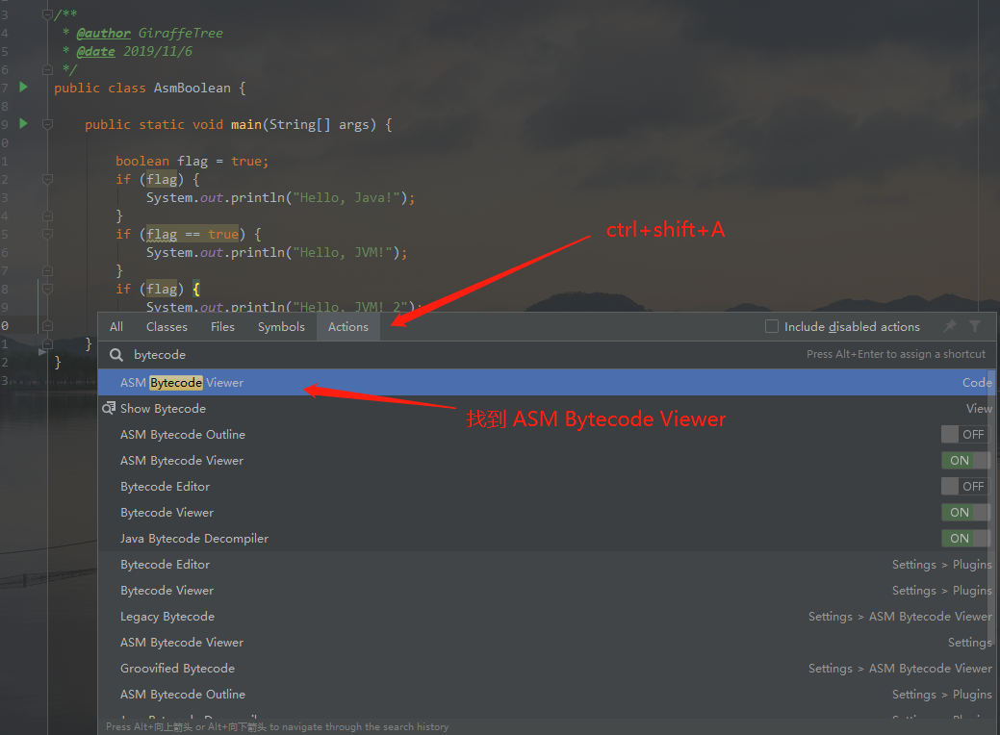
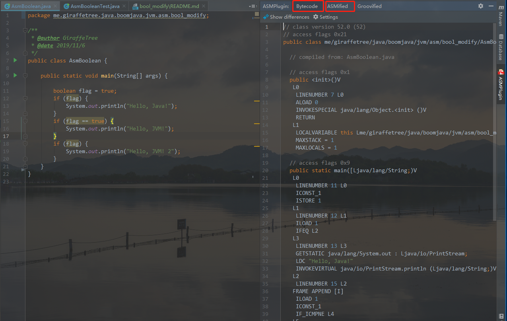
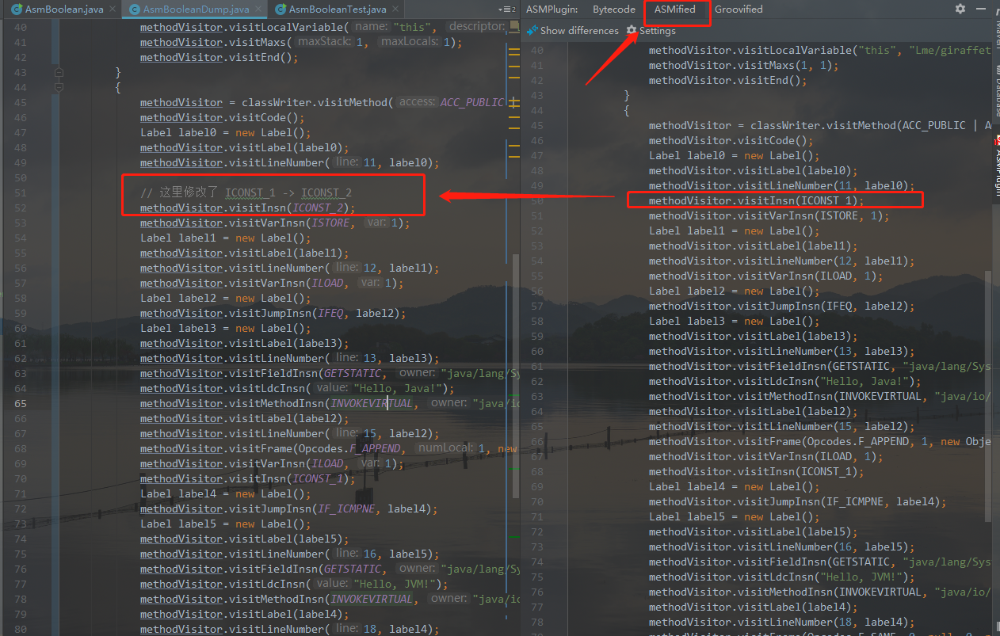
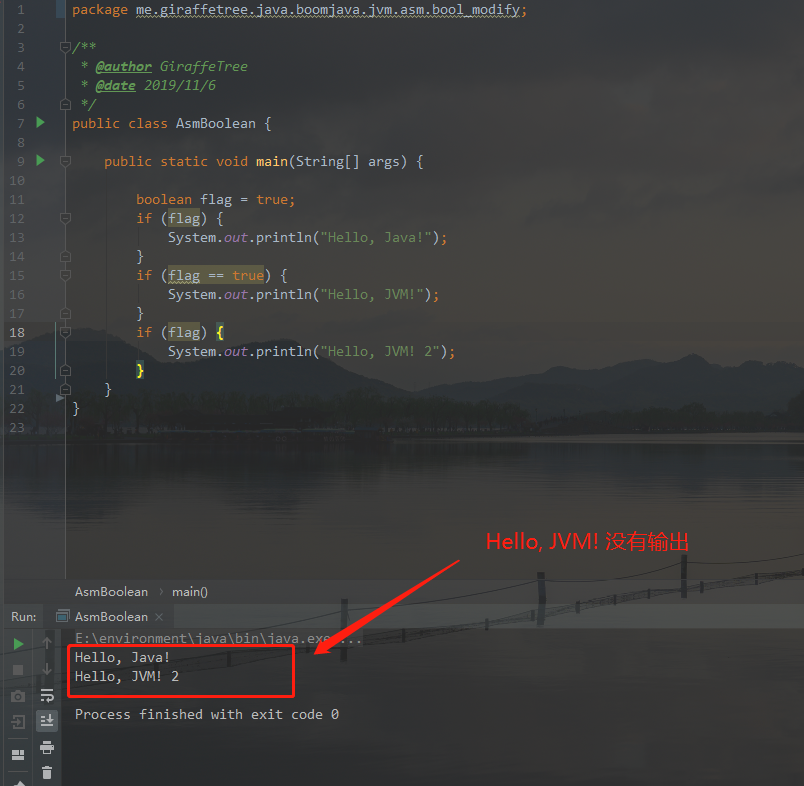

# JVM boolean

## 概述

通过 asm 修改局部变量表中的 boolean 值

## 工具 

安装 idea 中的 plugin: ASM bytecode viewer

### 如何使用

#### 1. 安装好 ASM bytecode viewer



#### 2. `AsmBoolean.java`

```java
public class AsmBoolean {

    public static void main(String[] args) {

     boolean flag = true;
        // 这里判断 flag 是不是为 0, 如果是 0, 则跳转
        // bytecode 为 ifeq
        if (flag) {
            System.out.println("Hello, Java!");
        }
        // 这里判断 flag 是不是 1 , 如果不是1, 则跳转
        // bytecode 为 if_icmpne
        if (flag == true) {
            System.out.println("Hello, JVM!");
        }
        // 这里同第一次, 判断 flag 是不是为 0, 如果是 0, 则跳转
        if (flag) {
            System.out.println("Hello, JVM! 2");
        }
    }
}
```

#### 3. 在idea中打开 `AsmBoolean.java`, 并找到 ASM bytecode viewer, enter 进入



#### 4. bytecode viewer



#### 5. asmified 生成字节码

asmified 能够将生成与源文件一致的字节码, 并且允许我们修改里面的代码, 
以达到修改字节码的目的

#### 6. 将 asmified 中的代码复制过来, 生成一个 .java 文件, 并且修改里面的字节码

这里我修改了一个 boolean 值, 将 1 改成了 2 (java 中的 boolean 在 jvm 中使用 int 表示)



#### 7. 覆盖原来的 class 文件, 再次运行 AsmBoolean

```java
public class AsmBooleanTest {
    public static void main(String[] args) throws Exception {
        // 使用生成的 AsmBoolean.class 代替 target 目录下的 AsmBoolean.class
        // 再运行 AsmBoolean , 会发现输出变了, jvm 中的 flag 值不为 true
        Files.write(Paths.get("target/classes/me/giraffetree/java/boomjava/jvm/asm/bool_modify/AsmBoolean.class"), AsmBooleanDump.dump());
    }
}
```

可以看到由于 flag 不为 1 , 导致第二次标准输出没有执行




