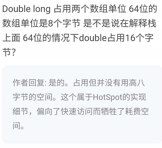

# 栈帧 stack frame

栈帧的组成

- 局部变量区
- 操作数栈
- 动态链接
- 方法出口

## 栈帧概述

## 组成

### 局部变量区

定义

- 局部变量表是以一个字长为单位, 从0开始计数的数组, 使用索引访问
- 局部变量表的容量以 变量槽 slot 为最小单位, slot 的大小为 字长
- long/double 在数组中占据连续的两个 slot, 并且采用两个 slot 中较小的索引值来定位

#### long/double 在64位JVM下的局部变量表中, 占用几个 slot?

先说结论: 

**64位的情况下, double/long 占用 16 个字节, 但是没有用高八字节的空间**
 
其实先开始我很困惑,在很多网站上都言之凿凿的写着 单个 slot 的大小为 32 bit, 但是也没有说明到底是在64bit还是32bitJVM上.

我先开始认为如果在 64 bit 的虚拟机中, 8种java基本数据类型 和 reference 都是 占用 64bit 的. 

但我 google 了很多, 他们都只说了在 32 bit 的虚拟机中, double/long 会占用两个 slot, 但没有说 64bit 的情况.

在 [jvm specification 11 2.6.1](https://docs.oracle.com/javase/specs/jvms/se11/html/jvms-2.html#jvms-2.6.1])中有下面一段话

> Each frame (§2.6) contains an array of variables known as its local variables. The length of the local variable array of a frame is determined at compile-time and supplied in the binary representation of a class or interface along with the code for the method associated with the frame (§4.7.3).
> 
> A single local variable can hold a value of type boolean, byte, char, short, int, float, reference, or returnAddress. A pair of local variables can hold a value of type long or double.
> 
> A value of type long or type double occupies two consecutive local variables. Such a value may only be addressed using the lesser index. For example, a value of type double stored in the local variable array at index n actually occupies the local variables with indices n and n+1; however, the local variable at index n+1 cannot be loaded from. It can be stored into. However, doing so invalidates the contents of local variable n.
>
> long/double 类型的值会占用两个连续的局部变量(slot), 并且使用较小的索引来访问

HotSpot 实战 P205: 这里其实明确了 slot 以字长为单位 

> 局部变量表是以一个字长为单位, 从0开始计数的数组, 使用索引访问

在[极客时间专栏 jvm](https://time.geekbang.org/column/article/11503) 的评论下面, 作者回复如下:  

虽然我不怎么相信上面说的为了快速访问而耗费了更多空间这个理由 =.= 

### 操作数栈

-  操作数栈也是一个以字长为单位的数组, 但它通过入栈和出栈来进行访问

