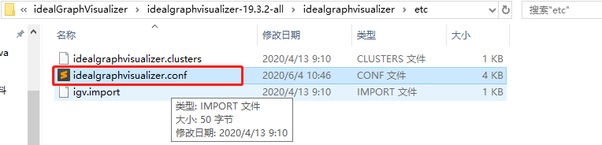
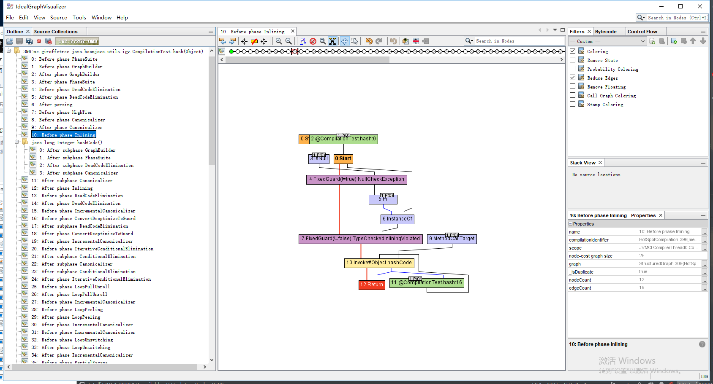
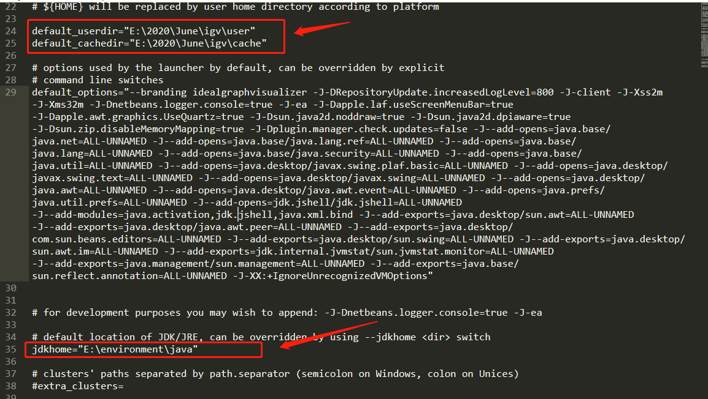

# Ideal Graph Visualizer 安装与使用

IR 可视化工具 , ideal 为 hotsport c2 编译器中 IR 的名字[1]

由于在安装使用过程中遇到了许多坑, 我决定还是写篇文章分享下遇到的这些问题.  

## 安装

### 下载

graal igv 的官方使用文档: [ideal-graph-visualizer](https://docs.oracle.com/en/graalvm/enterprise/20/guide/reference/ideal-graph-visualizer.html)

下载链接: [igv download](https://www.oracle.com/downloads/graalvm-downloads.html), 开个代理速度贼快 =.=

我自己使用的是 19.3.2 java 11 on windows

### 配置

解压后, 修改下 etc 文件夹中的 idealgraphvisualizer.conf

```
# 注意不要放在跟 idealgraphvisualizer 相同的目录下
default_userdir="E:\2020\June\igv\user"
default_cachedir="E:\2020\June\igv\cache"
# 写入你的 jdk 位置, 这里我用的 jdk8
jdkhome="E:\environment\java"
```



### 运行

双击 `bin/idealgraphvisualizer64.exe` 即可运行

如果出现其他错误, 可以通过 `cmd`, 然后运行 `bin/idealgraphvisualizer64.exe` 
看下打印出的日志, 然后排错. 

## 使用

### 示例1

[CompilationTest](./CompilationTest.java) 该代码示例来自 [1]

```java
public class CompilationTest {
    public static int hash(Object input) {
        if (input instanceof Exception) {
            return System.identityHashCode(input);
        } else {
            return input.hashCode();
        }
    }
    public static void main(String[] args) throws InterruptedException {
        for (int i = 0; i < 500000; i++) {
            hash(i);
        }   
        // 需要等待一段时间, 让后台线程将数据传给 igv
        Thread.sleep(2000);
    }
}
```

参数我这里进行了微调

```
-XX:+UnlockExperimentalVMOptions -XX:+UseJVMCICompiler -XX:CompileCommand=dontinline,"CompilationTest::hash" -Dgraal.Dump=:3 -Dgraal.MethodFilter=me.giraffetree.java.boomjava.utils.igv.CompilationTest.hash -Dgraal.OptDeoptimizationGrouping=false -Dgraal.PrintGraph=Network
```

- `-Dgraal.PrintGraph=Network` 可以通过网络直接传给 igv , 而不是通过文件
- `-Dgraal.MethodFilter=me.giraffetree.java.boomjava.utils.igv.CompilationTest.hash` 由于我是在 idea 项目中运行, 有包名, 实际运行时请根据自己的项目修改
    - 关于 MethodFilter 的规则参考文档 [4]
- 我使用的 jre 为 jdk11.0.7
- 在项目根目录下会生成  `graal_dumps` 文件夹

> 示例命令如下:
>  
> java -XX:+UnlockExperimentalVMOptions -XX:+UseJVMCICompiler -XX:CompileCommand=dontinline,"CompilationTest::hash" -Dgraal.Dump=:3 -Dgraal.MethodFilter=CompilationTest.hash -Dgraal.OptDeoptimizationGrouping=false -Dgraal.PrintGraph=Network CompilationTest

```
CompileCommand: dontinline CompilationTest.hash
[Use -Dgraal.LogFile=<path> to redirect Graal log output to a file.]
Connected to the IGV on 127.0.0.1:4445
```



### 示例2

> 红色加粗线条为控制流，蓝色线条为数据流，而其他颜色的线条则是特殊的控制流或数据流。
> 被控制流边所连接的是固定节点，其他的皆属于浮动节点


## 我遇到的一些坑

### 使用 github idealgraphvisualizer-543

先开始我并不是用的上面所说的这个版本的 igv ,而是使用 github graal 上的 [idealgraphvisualizer-543](https://github.com/oracle/graal/releases/tag/idealgraphvisualizer-543)

#### Your user directory cannot reside inside your NetBeans installation directory 与 Cannot find java 1.8 or higher

下载好之后, 需要解压缩, 然后在 `etc` 文件夹中的 `idealgraphvisualizer.conf` 进行配置

```
# 注意不要放在跟 idealgraphvisualizer 相同的目录下
# 不然会提示一个 Your user directory cannot reside inside your NetBeans installation directory 错误
default_userdir="E:\2020\June\igv\user"
default_cachedir="E:\2020\June\igv\cache"

# 需要手动设置 jdkhome
# 不然会提示 Cannot find java 1.8 or higher
jdkhome="E:\environment\java"
```



#### Caused: org.graalvm.visualizer.data.serialization.VersionMismatchException: File format version 6.1 unsupported.  Current version is 6.0

当我以为我启动了 igv 就大功告成的时候, 运行代码却得到一个版本号过低的错误. 看起来这个像是我生成的数据版本过高导致的. 所以我可能应该找一个更高版本的 igv. 

但我当时在 github graal release 下翻了半天也没找到更新的版本...我陷入了沉思.....

第二天偶然查找到 graal vm 官网上的 advanced tools 时, 终于找到了这个更新的版本, 就是上面所说的那个版本了 [3]

## 参考

1. https://time.geekbang.org/column/article/14270
    - 感谢郑雨迪老师带我入的这个坑 哈哈哈
2. https://github.com/oracle/graal/releases/tag/idealgraphvisualizer-543
3. GraalVM Enterprise 19.3.2 Details → Free for evaluation and development
   	- https://docs.oracle.com/en/graalvm/enterprise/20/guide/reference/ideal-graph-visualizer.html
   	- https://www.oracle.com/downloads/graalvm-downloads.html
4. http://lafo.ssw.uni-linz.ac.at/javadoc/graalvm/all/com/oracle/graal/debug/MethodFilter.html

