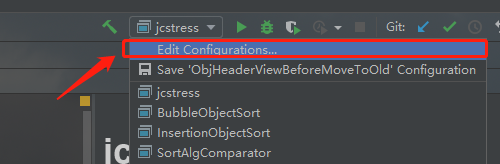
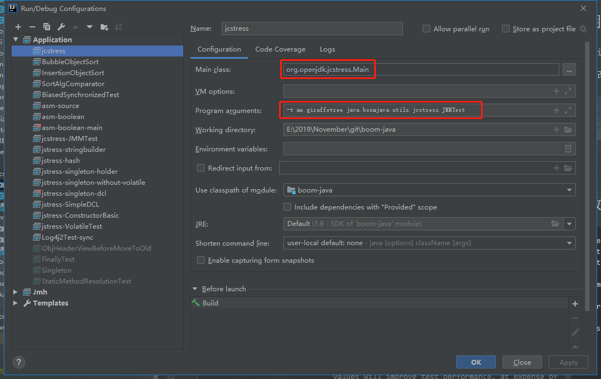
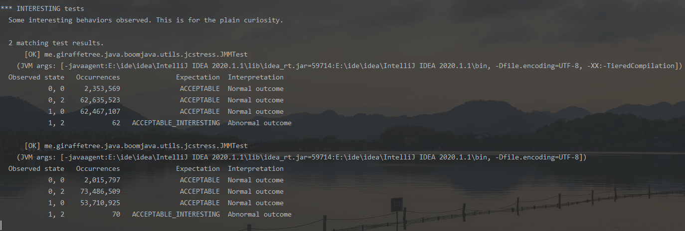

# jcstress 入门教程

## 概述

有些博客上总写一个用 maven 打包成 jar , 然后进行 jcstress 测试的方案, 感觉用起来太麻烦了. 

所以这里介绍一个配合 idea 使用的方案

## 使用

比如我这边要测试 [JMMTest.java](./JMMTest.java) 这个文件

点击修改 运行配置



- main class 一栏输入
    - `org.openjdk.jcstress.Main`
- program arguments 一栏输入
    - `me.giraffetree.java.boomjava.utils.jcstress.JMMTest`
    - `-v -t me.giraffetree.java.boomjava.utils.jcstress.JMMTest`
    - 都行哈
    


运行即可, 结果如下




## 参数介绍

```
Usage: java -jar jcstress.jar [options]
 [opt] means optional argument.
 <opt> means required argument.
 "+" means comma-separated list of values.
 "time" arguments accept time suffixes, like "100ms".

  [arguments]                 

  -bs <#>                     Maximum number of tests to execute in a single VM. Larger 
                              values will improve test performance, at expense of 
                              testing accuracy 

  -c <N>                      Concurrency level for tests. This value can be greater than 
                              number of CPUs available. 

  -deoptRatio <N>             De-optimize (roughly) every N-th iteration. Larger value 
                              improves test performance, but decreases the chance we hit 
                              unlucky compilation. 

  -f [count]                  Should fork each test N times. "0" to run in the embedded mode 
                              with occasional forking. 

  -h                          Print this help. 

  -iters <N>                  Iterations per test. 

  -jvmArgs <string>           Use given JVM arguments. This disables JVM flags 
                              auto-detection, and runs only the single JVM mode. Either a 
                              single space-separated option line, or multiple options 
                              are accepted. This option only affects forked runs. 

  -jvmArgsPrepend <string>    Prepend given JVM arguments to auto-detected 
                              configurations. Either a single space-separated option 
                              line, or multiple options are accepted. This option only 
                              affects forked runs. 

  -l [bool]                   List the available tests matching the requested settings. 

  -m <mode>                   Test mode preset: sanity, quick, default, tough, stress. 

  -maxStride <N>              Maximum internal stride size. Larger value decreases the 
                              synchronization overhead, but also reduces accuracy. 

  -mf <MB>                    Maximum footprint for each test, in megabytes. This 
                              affects the stride size: maximum footprint will never be 
                              exceeded, regardless of min/max stride sizes. 

  -minStride <N>              Minimum internal stride size. Larger value decreases the 
                              synchronization overhead, but also reduces accuracy. 

  -p <result file>            Re-run parser on the result file. This will not run any 
                              tests. 

  -r <dir>                    Target destination to put the report into. 

  -sc <N>                     Number of CPUs in the system. Setting this value overrides 
                              the autodetection. 

  -t <regexp>                 Regexp selector for tests. 

  -time <ms>                  Time to spend in single test iteration. Larger value 
                              improves test reliability, since schedulers do better job 
                              in the long run. 

  -v                          Be extra verbose. 

  -yield [bool]               Call Thread.yield() in busy loops. 

```


