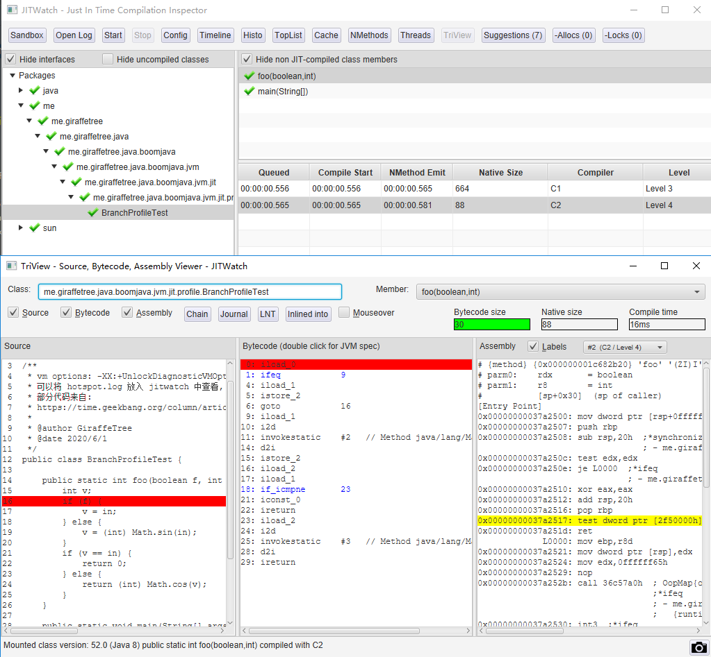

# 关于如何打印 JIT 编译后的 汇编代码 - jitwatch 的使用

## 关于如何打印 JIT 编译后的 汇编代码

关于这个问题, 一般有以下几种方法

1. 使用 debug 版本的openjdk  `-XX:+PrintAssembly`
2. 使用JDK发行版 +  `hsdis-amd64.dll` +  `-XX:+PrintAssembly`
3. 使用 `hsdis-amd64.dll` + log + jitwatch

### 方法1 使用 debug 版本的openjdk

参见: https://github.com/ojdkbuild/ojdkbuild [1]

使用 `-XX:+PrintAssembly` 启动 java 程序即可

#### 方法2 使用 `hsdis-amd64.dll` +  `-XX:+PrintAssembly`

这种方法可以使用我们平常使用的 jdk , 只需要加上一个 dll 就可以了

如果出现 `Could not load hsdis-amd64.dll; library not loadable; PrintAssembly is disabled`

需要下载 hsdis-amd64.dll , 我使用的是 win10 ,下载地址

> http://vorboss.dl.sourceforge.net/project/fcml/fcml-1.1.1/hsdis-1.1.1-win32-amd64.zip
            
解压后将 hsdis-amd64.dll 和 hsdis-amd64.lib 放在 jdk 的 bin 目录下即可

#### 方法3 使用 jitwatch

第一步, 下载并启动 jitwatch [2]

下载 [Release](https://github.com/AdoptOpenJDK/jitwatch/releases) 版本然后启动 `launchUI.bat`/ `launchUI.sh`

第二步, 生成 log 文件

java 运行时的 vm 参数, 这里我指定了 logFile 的位置, 防止它每次都生成一个

`-XX:+UnlockDiagnosticVMOptions -XX:+PrintAssembly -XX:+LogCompilation -XX:LogFile=hotspot.log `

第三步, 配置 jitwatch

配置 source/class location

open log 文件

第四步, start 分析

点击 start 即可

## 参考

1. openjdk8 debug
    - https://github.com/ojdkbuild/ojdkbuild
2. jitwatch 介绍
    - https://juejin.im/post/5e10aecbe51d4541145de5a8
3. jitwatch 官方 wiki 关于下载 hsdis.dll 的问题
    - https://github.com/AdoptOpenJDK/jitwatch 
    - https://github.com/AdoptOpenJDK/jitwatch/wiki/Instructions
