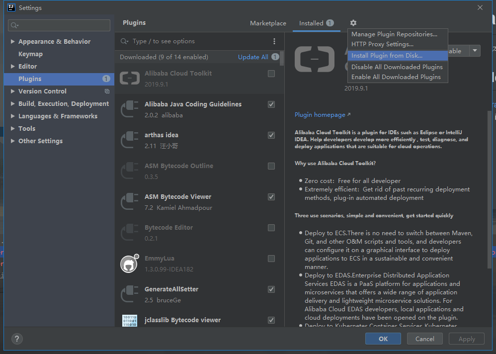
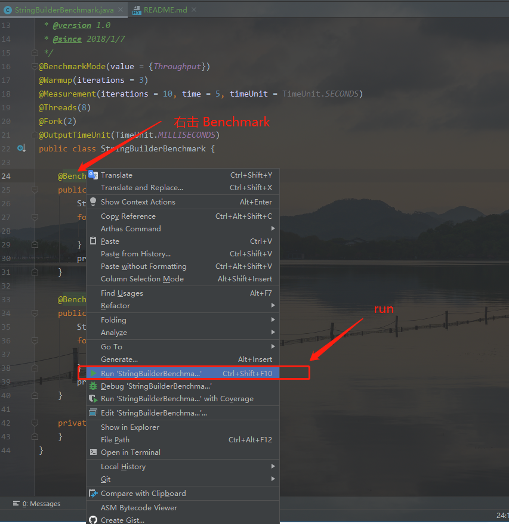
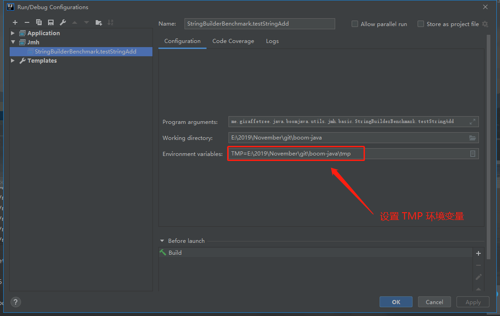
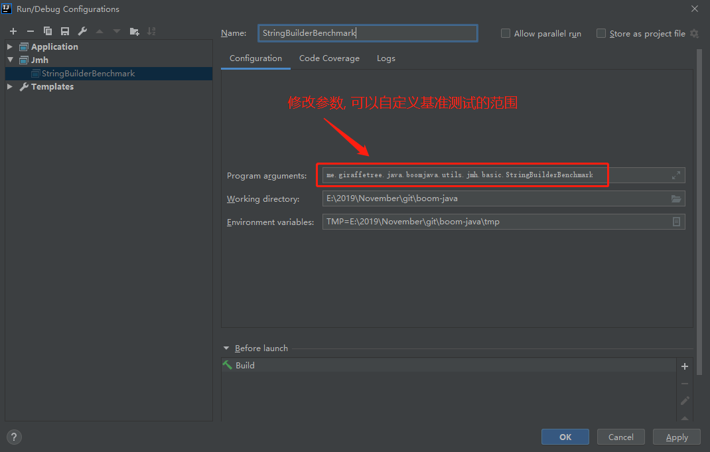
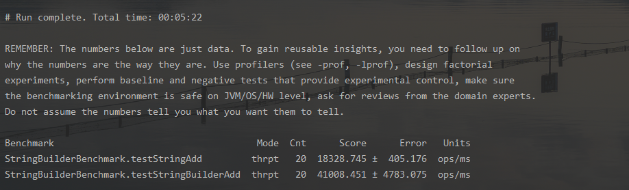

# JMH (Java Microbenchmark Harness) idea 使用指南

目前我使用的 idea 版本为 2020.1.1

## 步骤

### 下载 JMH idea plugins

在 plugins 中搜索安装或者在 https://plugins.jetbrains.com/plugin/7529-jmh-plugin/versions 这里下载, 
然后在 settings 中 plugins install from disk



安装完成后重启 idea

### 使用

#### pom 

配置示例如下

```xml
        <jmh.version>1.23</jmh.version>

        <!-- JMH-->
        <dependency>
            <groupId>org.openjdk.jmh</groupId>
            <artifactId>jmh-core</artifactId>
            <version>${jmh.version}</version>
        </dependency>
        <dependency>
            <groupId>org.openjdk.jmh</groupId>
            <artifactId>jmh-generator-annprocess</artifactId>
            <version>${jmh.version}</version>
            <scope>provided</scope>
        </dependency>
```

#### 运行

这里我使用 [StringBuilderBenchmark.java](./basic/StringBuilderBenchmark.java) 这个文件测试



#### 错误

```
ERROR: org.openjdk.jmh.runner.RunnerException: ERROR: Exception while trying to acquire the JMH lock (C:\WINDOWS\/jmh.lock): 拒绝访问。, exiting. Use -Djmh.ignoreLock=true to forcefully continue.
	at org.openjdk.jmh.runner.Runner.run(Runner.java:216)
	at org.openjdk.jmh.Main.main(Main.java:71)
```

需要设置 TMP 环境变量, 这里我设置的是我项目中的地址 `TMP=E:\2019\November\git\boom-java\tmp`



- 参考解决方案: 
    - https://github.com/artyushov/idea-jmh-plugin/issues/19

#### benchmark 的范围

修改基准测试的范围, 可以更好的对比



结果:



## 其他

关于 JMH 的注解解释可以参考: [https://www.xncoding.com/2018/01/07/java/jmh.html](https://www.xncoding.com/2018/01/07/java/jmh.html) , 这里我就不重复写了
